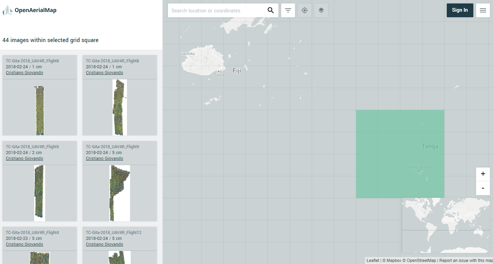
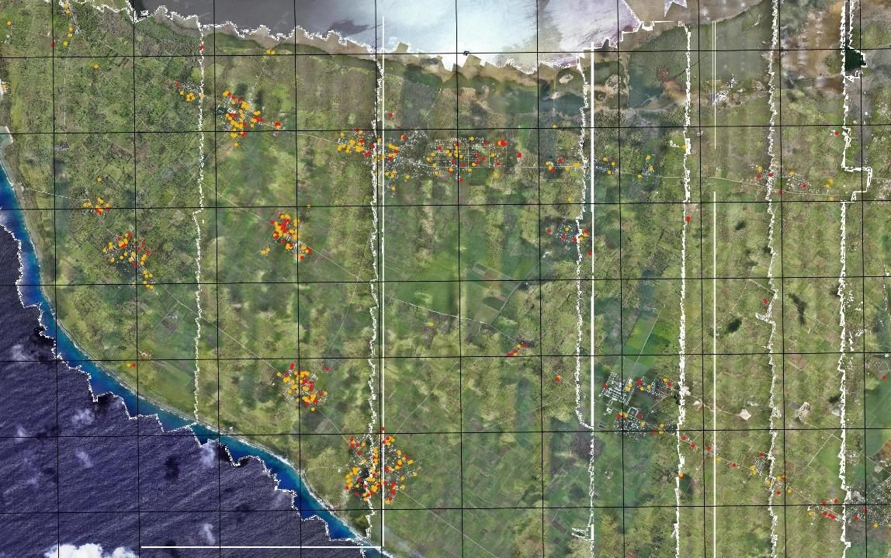

9. After the Flight: Processing the Data

Flying and collecting imagery is often the easiest step in UAV mapping, while preparing and processing imagery often requires significant computing and human efforts. Photogrammetric software that employs processes such as Structure from Motion (SfM) is actively and continuously improved to reduce the level of effort required and to automate the processing work flow.

## Processing software and hardware

Most software used to process UAV data is developed by commercial firms and offered through pricey subscription options or permanent desktop licenses. Some of the same companies also offer cloud-based processing services that allow for uploading imagery to scalable cloud computing infrastructure. In environments with limited Internet connectivity, this option is often not suitable for UAV mapping projects, which require uploading massive amounts of data (tens to hundreds of gigabytes) to the cloud before processing can start.

As of 2018, the open source options for UAV imagery processing software are quite limited. The most popular and mature programs are [OpenDroneMap](http://opendronemap.org/) and its sister project [WebODM](https://www.webodm.org). Table 5 lists some of the most popular UAV processing software available and its pricing.

Table 11. Comparison of Popular UAV Image Processing Software Programs

<table>
  <tr>
   <td><strong>Software</strong>
   </td>
   <td><strong>Options</strong>
   </td>
   <td><strong>License</strong>
   </td>
   <td><strong>Monthly / permanent price (US$)</strong>
   </td>
  </tr>
  <tr>
   <td>DroneDeploy
   </td>
   <td>Cloud
   </td>
   <td>Commercial
   </td>
   <td>399 (monthly only)
   </td>
  </tr>
  <tr>
   <td>Pix4Dmapper
   </td>
   <td>Desktop + cloud
   </td>
   <td>Commercial
   </td>
   <td>350 / 8,700
   </td>
  </tr>
  <tr>
   <td>Photoscan
   </td>
   <td>Desktop
   </td>
   <td>Commercial
   </td>
   <td>3,499 (permanent only)
   </td>
  </tr>
  <tr>
   <td>Correlator3D
   </td>
   <td>Desktop
   </td>
   <td>Commercial
   </td>
   <td>295 / 5,900
   </td>
  </tr>
  <tr>
   <td>OpenDroneMap
   </td>
   <td>Desktop
   </td>
   <td>Open Source
   </td>
   <td>Free
   </td>
  </tr>
</table>

_Source: Information on software compiled form manufacturers' materials_

Several UAV manufacturers offer processing software along with their UAVs, which can result in a significantly lower final cost than if UAV hardware and software are bought separately. It is worth inquiring before purchasing a mapping platform what software is included in the purchasing price. Using software that is provided with the mapping platform is often the best option.

The average amount of data processed in UAV mapping is large, often larger than in traditional GIS projects. Like many remote sensing projects, UAV mapping requires intensive computations and large storage and memory capacity for data processing. This type of processing is normally done on large workstations set up with multicore CPUs, at least 16GB of RAM, and fast solid-state drive (SSD) disks. Some key processing steps employ computer vision (CV) algorithms, which require advanced graphics processing units (GPUs) that are typically found only in expensive scientific and gaming video cards. 

Desktop workstations for UAV image processing can cost anywhere from US$2,000 (low end, for projects up to ~1,000 image frames) to US$10,000. As processing often needs to be done in the field or while deployed in a disconnected environment, a bulky workstation is not the ideal solution. A valid alternative for small to medium-size projects (100–5,000 frames) is offered by gaming laptops, which are often already equipped with configurations similar to those needed for UAV image processing (advanced CPU, SSDs and large storage, sizable RAM, a dedicated video card). In addition, if processing is to be conducted in the field, it is advisable to use ruggedized equipment and to have several charged battery packs as backup options. 

## Post-processing work flow to create orthomosaics

Whether on a desktop, on laptop, or in a cloud computing environment, the processing work flow to obtain orthomosaics from UAV-collected imagery is very similar. The main steps involved, mostly performed automatically by the software, are the following:

1. Import image files (and optionally create overviews).
2. Import GPS log and match with images (not necessary if GPS information is already available through image EXIF metadata).
3. Select processing parameters and algorithm types (if choices are available).
4. Extract features/points from each frame.
5. Create camera model.
6. Carry out feature matching and automatic triangulation.
7. Carry out bundle block adjustment and AT model refinement.
8. Import GCPs and carry out manual matching to corresponding image features.
9. Conduct color balancing.
10. Generate dense point cloud and digital surface model (DSM). 
11. Extract digital terrain model (DTM) from DSM (with optional manual editing).
12. Carry out seamline generation and make manual adjustments.
13. Carry out orthomosaic generation (with optional overviews generation).
14. Issue output of final products in GIS-compatible formats (e.g., GeoTIFF).

Processing 200 image frames locally on a gaming laptop to produce an orthomosaic typically requires one to two hours to complete. Some of the manual steps include importing input files (images, GPS log, etc.) and matching GCPs. Everything else can follow predefined processing parameters and eventually be scripted to run fully autonomously.  

A processing report is usually generated by the software, including quality control and assurance indicators about the processing work flow and the final data products. For example, it’s possible to use a number of GCPs as “checkpoints” to verify the internal and absolute positional accuracy of the output model compared to known reference locations. Root-mean-square error tables and charts are often available in the report to assess each point’s horizontal and vertical accuracy against predicted values. 

## Data processing following 2018 TC Gita Response Survey

During the field surveys conducted in February 2018 (see chapter 11 for more details), the imagery data were processed by individual flight. As a result, the island of Tongatapu was divided into strips of smaller orthomosaics that each corresponded to a UAV flight. To improve the accuracy of the results and radiometric quality across the whole island, all the imagery was subsequently processed into one large block, generating a seamless mosaic that covered the entire island area (more than 260 km2). To make this large orthomosaic easy to share with end users, the large GeoTIFF file was then divided into 1 km2 tiles. Figure 13 shows some of the strips from the original UAV flights (on the left of the image), while Figure 14 shows the boundaries of the reprocessed 1 km2 tiles. The orthomosaic of the whole island was uploaded to OpenAerialMap.org. 

>>>>>  gd2md-html alert: inline image link here (to images/Technical-Guidelines14.png). Store image on your image server and adjust path/filename if necessary.  (<a href="#">Back to top</a>)(<a href="#gdcalert16">Next alert</a>) >>>>> 

_Figure 13. User interface of OpenAerialMap.org showing UAV images that are available for Tonga._

_Source: Open Imagery Network contributors. Licensed under Creative Commons Attribution 4.0 International (CC BY 4.0), [https://creativecommons.org/licenses/by/4.0/legalcode](https://creativecommons.org/licenses/by/4.0/legalcode)._

    

>>>>>  gd2md-html alert: inline image link here (to images/Technical-Guidelines15.jpg). Store image on your image server and adjust path/filename if necessary.  (<a href="#">Back to top</a>)(<a href="#gdcalert17">Next alert</a>) >>>>> 

_Figure 14 Image showing location of the structures assessed as damaged (in orange) and destroyed (in red). _

Source: Open Imagery Network contributors. Licensed under Creative Commons Attribution 4.0 International (CC BY 4.0), [https://creativecommons.org/licenses/by/4.0/legalcode](https://creativecommons.org/licenses/by/4.0/legalcode).

## Sharing Data and Imagery 

All geospatial data produced by UAV data processing software should be outputed into formats that can be readily consumed in common GIS programs such as ESRI ArcGIS and Quantum GIS. Data created using UAVs can be shared in various ways. For instance, DTMs, DSMs, and point clouds can be shared on opentopography.org as open data. Orthomosaics can be shared by uploading onto the [OpenAerialMap](https://openaerialmap.org/) platform (Figure 13). These orthomosaic datasets are foundational layers of information used in many humanitarian and surveying project applications, from baseline mapping (tracing) to remote damage assessment. 

Sharing of UAV data and imagery must take into account both product formats and privacy issues:

*   _Product formats._ The generated output imagery mosaic is often a very large raster file (from tens to hundreds of gigabytes), with three bands of RGB value combinations representing colors in the visible range of the electromagnetic spectrum. The most common format for output is GeoTIFF. In order to facilitate handling and opening of such large files, the full mosaic may be split into same-size tiles, labeled in a grid sequence, and indexed by a shapefile or other schema file (e.g., VRT). Other options for portability and sharing include lossless (e.g., LZW) and lossy (e.g., JPEG 2000) compression algorithms that can drastically reduce the final file size.
*   _Privacy issues._ Compared to typical satellite images, UAV imagery offers an incredible level of detail. This feature allows for novel applications, such as identification of damaged structures after a hurricane or earthquake. But it also raises privacy issues, especially when such high-resolution imagery is shared with others outside of the project for which UAV flying was authorized. The UAViators’ code of conduct (UAViators, n.d.) and summary of best practices (UAViators 2015) can help guide decisions on how to handle and share collected imagery. If necessary, measures such as downsampling or blurring can be taken to protect people’s privacy or respect the sensitivity of specific areas.